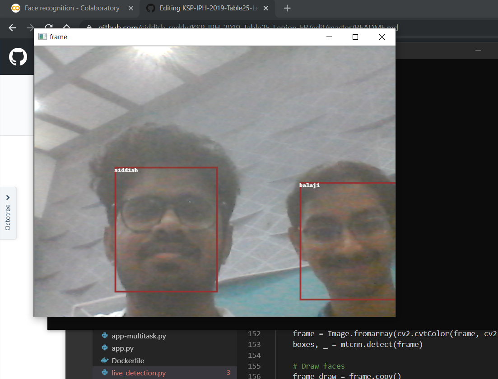

# KSP-IPH-2019-Table25-Legion-FR
Facial Recognition problem submission by Team Legion (Table 25)

### Test Results:
Here is the top predictions matched from missing folder to other folder: [Table of image results](Test_Results.csv).
To search or view add this folder to your drive and search in drive or plot using 
```
def plot(images_array):
  fig, axs = plt.subplots(len(images_array),2, figsize = (8, len(images_array)*2.6))
  for i in range(len(images_array)):
    for j in range(2):
      axs[i,j].imshow(mpimg.imread(images_array[i][j]))
      axs[i,j].set_title(str(i)+' '+ str(j))
  plt.show()
```

### Project synopsis:

The given task of finding a photo a missing person revolves around the around combined task of facial detection and recognition, which deals with extracting the facial features of a person face and lookup for the same in database, or surveillance cameras, or social media.
When there is a match the system brings up the notification saying that the suspect is located with the demographic and related metadata.
The oppurtunity is to bring these functionalities all under one real time working applicationin an optimal way.

#### Tools and Libraries used:
 - [Pytorch](https://pytorch.org/)  v1.3 Open-source 
 - [Facenet](https://github.com/timesler/facenet-pytorch) (latest version) Open-source
 - [OpenCV Python](https://github.com/skvark/opencv-python) (v2) Open-source
 - [Google Colab](https://github.com/googlecolab) (free for education and research)
 - [Scipy](https://www.scipy.org/) ecosystem like Numpy, Pandas, matplotlib, jupyter; Open-source
 
 #### Code and Resources:
  - [Training notebook](https://github.com/siddish-reddy/KSP-IPH-2019-Table25-Legion-FR/blob/master/Face_recognition.ipynb) 
  - Facial features embeddings from given datasets [Drive link](https://drive.google.com/open?id=1WL2eP_K-6XhAp2_PL4dslpmbzBcp_YV4)
  
#### Process overview:
 

#### Output:
 Live recognition from camera:
 
 
 
 #### How to run:
 - Install Python 3.6+
 - Install Pytorch, Opencv, facenet_pytorch, jupyter, scipy libraries
 - Download necessary images for testing from [here](https://drive.google.com/open?id=1SfISeJ8nlAqX5mfytQrfV6f7_4GcJH23)
 - For live recognition first at least extract face encodings from one image and then run `python live_face_recognition.py`
 - For generating face encodings using any of pretrained models of facenet and measure similarity of faces by using cosine similarity or euclidean distance, it is best to train custom metric learner as both cosine similarity and L2 distance aren't efficient for higher dimensional data.
 
